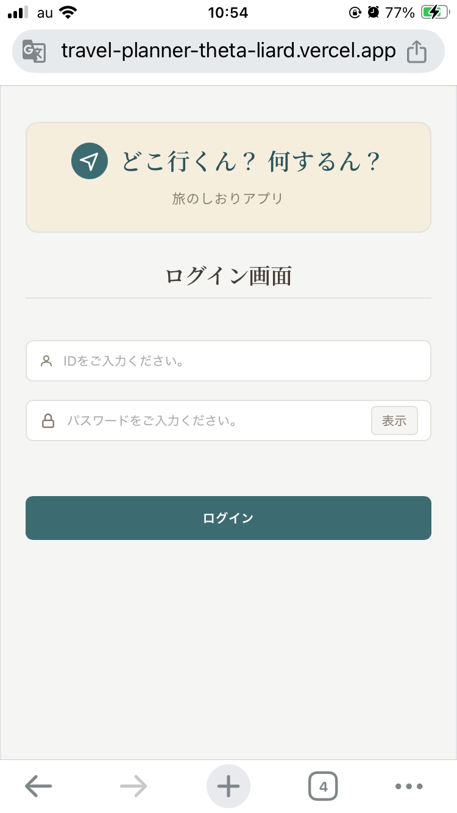
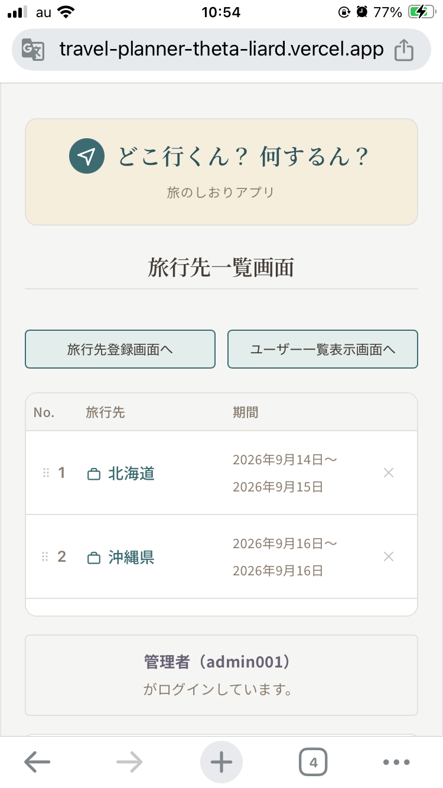
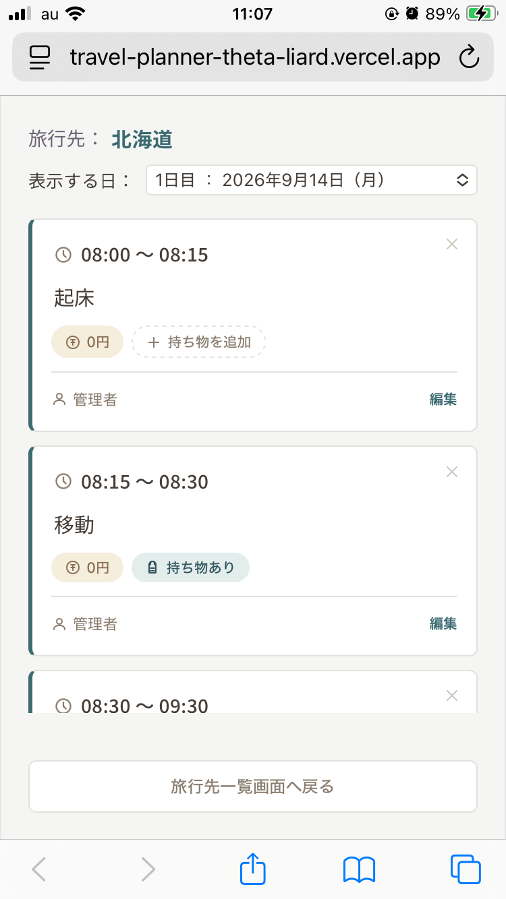

# 🗺️ どこ行くん？ 何するん？

### 〜 予算も持ち物も、これ一つでスマートに整う「旅のしおり」アプリケーション 〜

<!-- アプリケーションの雰囲気が伝わる画像 -->
<p align="center">
  
  
  
</p>

---

## 🚀 アプリケーションURL

- **本番公開URL：** `https://travel-planner-theta-liard.vercel.app/`
- **テスト用管理者アカウント：**
  - **ID：** `admin001`
  - **パスワード：** `AdminPass123`
- **テスト用編集ユーザー 1：**
  - **ID：** `user001`
  - **パスワード：** `Password123`
- **テスト用編集ユーザー 2：**
  - **ID：** `user002`
  - **パスワード：** `PassWord456`

---

## 📝 アプリケーションの概要

「旅行の計画を立てる楽しさを、もっと身近に、もっと心地よく。」をコンセプトにした、複数メンバーでリアルタイムに共同編集できる旅のしおり作成アプリです。
旅行先の登録から、日毎のタイムスケジュールの登録、予定毎の予算管理、持ち物リストの作成まで、旅行時に最低限必要な情報をスマートフォンやPCから直感的に一元管理できます。

なお、あくまで一つの目安、希望をまとめるためのものであり、この通りに進めないといけないとか、進めてくれないとダメといったものではありません。予定通りに進めることよりも「旅行自体を楽しむこと」が最優先であることを忘れないでいただけると幸いです。

---

## 💡 開発背景

旅行の計画を立てる際、これまでGoogleスプレッドシートを利用して日程を作成していました。
自由度が高いものの、一からフォーマットを作成したり、既存のフォーマットから作成するにもスマートフォンの画面では見づらかったりと不便さを感じていました。
また、「日程ごとのスケジュールが把握しづらい」「スケジュール毎の予算や持ち物を管理すると煩雑になる」といった課題もありました。

これらを解決し、旅行前からメンバー全員がワクワクしながら、操作に迷わず、スムーズに旅行計画を立てられることを目指して、本アプリケーションを開発しました。

---

## ✨ 主な機能と画面説明

### 1. 旅行先一覧・ドラッグ＆ドロップ並び替え機能

- 計画中の旅行先をカード形式で一覧表示。期間の自動計算バナーも搭載。
- **UXのこだわり：** 左端のグリップアイコン（⋮⋮）を掴むことで、スマートフォンでも直感的に旅行先の順序を上下に並び替えられるドラッグ＆ドロップ機能を実装しています。

### 2. 日付・曜日自動最適化タイムスケジュール

- 日付を指定して予定を登録すると、システムが自動的に日毎、時間の昇順で予定を並べ、表示します。
- 開始時刻・終了時刻が逆転しないよう、フロントエンド・バックエンドの双方で厳格なバリデーション（入力チェック）を行っています。

### 3. スケジュール連動型「予算・持ち物管理タグ」

- 予定ごとに「予算設定」や「持ち物リスト」をポチッと設定可能です。
- 持ち物を設定している場合は、「持ち物あり」と表示され、ひと目で把握しやすくなっています。

### 4. 堅牢なセキュリティとユーザー管理

- パスワードは「8文字以上かつ大文字必須」の厳格なバリデーションを搭載しています。
- 「ユーザー一覧・編集画面」は、特権管理者（`admin001`）のみがアクセスできるようにして、意図しないユーザー登録が行われないようにしています。

---

## 🛠️ 主な使用技術

### フロントエンド（Frontend）

- React 19 / JavaScript (ES10)
- CSS3（インラインスタイルを排除し、完全なコンポーネント分離によるクリーンコード化を徹底）
- Vercel（高速グローバルCDNによるデプロイ）

### バックエンド（Backend）

- Java 21 / Spring Boot 4
- Spring Data JPA / Hibernate (オブジェクト・リレーショナル・マッピングの最適化)
- Render（マルチステージ・ビルドによるコンテナ化デプロイ）

### データベース（Database）

- Aiven MySQL 8.0（海外クラウド・マネージドサービス）

---

## 📊 ER図（データベース論理構造）

- 📄 **[ER図（PDF）を確認する](./docs/er-diagram.pdf)**

---

## 🌐 システム構成図（プロダクション環境）

- 📄 **[システム構成図（PDF）を確認する](./docs/system-configuration-diagram.pdf)**

---

## 💻 ローカル環境での起動方法

手元のパソコンで本プロジェクトを自身のローカル環境（PC）にクローンし、起動させるための手順です。

### 1. 前提条件

PCに以下のツールがインストールされていることを確認してください。

- **Git**
- **Docker / Docker Compose**
- **Node.js (v24以上推奨)** ※フロントエンドをローカルで単体起動・修正する場合
- **Java 21 / Maven** ※バックエンドをローカルで単体起動・修正する場合

---

### 2. 環境構築・起動の5ステップ

#### ステップ①：リポジトリのクローン

ターミナルまたはコマンドプロンプトを開き、プロジェクトを配置したいディレクトリで以下のコマンドを実行します。

```bash
# 1. 公開用リポジトリからソースコードを手元にダウンロードします
git clone https://github.com/Sorewa07/travel-planner-public.git

# 2. クローンしたプロジェクトのルートフォルダに移動します
cd travel-planner-public
```

#### ステップ②：環境変数ファイル（.env）の作成

本番用の秘匿情報を守りつつ、ローカル環境を安全に立ち上げるための環境変数ファイルを作成します。
プロジェクトのルート直下（`docker-compose.yml` がある場所）に **`.env`** という名前のファイルを新規作成し、以下の内容を貼り付けて保存してください。

```ini
# --- ローカル開発用のデータベース接続設定 ---
SPRING_DATASOURCE_URL=jdbc:mysql://localhost:3306/defaultdb?allowPublicKeyRetrieval=true&useSSL=false&serverTimezone=Asia/Tokyo
SPRING_DATASOURCE_USERNAME=avnadmin
SPRING_DATASOURCE_PASSWORD=Password123
```

#### ステップ③：Dockerコンテナのビルド・起動

Docker Compose を利用して、ローカル開発用のデータベース（MySQLコンテナ）を自動で組み立て、バックグラウンドで起動します。

```bash
# コンテナのビルドとバックグラウンド一括起動
docker-compose up -d --build

# 起動ステータスの確認（すべてのコンテナが「Up」になっていればOKです）
docker-compose ps
```

#### 🔑 ステップ④：初期管理者アカウント（admin001）の作成

クローン直後のローカルデータベースは完全に空っぽの状態です。アプリの内部（旅行先一覧画面など）をすぐに体験できるよう、以下のコマンドを1発実行して、ローカルDB内に最初の管理者アカウントを生成してください。

```bash
# Dockerコンテナ経由で、ローカルMySQLに初期管理者データを1発で流し込みます
docker run -it --rm --network travel-planner-public_default mysql:8.0 mysql -h mysql-container -u avnadmin -pPassword123 defaultdb -e "INSERT INTO user (user_id, user_name, password, created_at, updated_at) VALUES ('admin001', '管理者', 'AdminPass123', NOW(), NOW());"
```

_※ネットワーク名（`travel-planner-public_default`）は、お使いの環境に合わせて必要に応じて調整してください。_

#### ステップ⑤：バックエンド（Spring Boot）のセットアップ・起動

データベースコンテナが立ち上がったら、APIサーバー（Java）を起動します。初回起動時に、JPA（Hibernate）の自動生成機能によって必要なテーブル構造（user, travel, schedule）および各カラムがローカルDB内に全自動で構築されます。

- **IDE（Eclipse / STS / IntelliJ）を使用する場合：**
  1. プロジェクトを Maven プロジェクトとしてインポートします。
  2. `src/main/java` 内の `BackendApplication.java` を右クリックし、「Javaアプリケーションとして実行」または「Spring Boot アプリケーションとして実行」を選択して起動します。
- **コマンドライン（Maven）を使用する場合：**
  ```bash
  # ルート直下でバックエンドサーバーを起動
  ./mvnw spring-boot:run
  ```
  _※バックエンドは `http://localhost:8080` でスタンバイ状態になります。_

#### ステップ⑥：フロントエンド（React）のセットアップ・起動

最後に、画面（UI）を動かすためのNode.jsパッケージをインストールし、ローカル開発サーバーを立ち上げます。

```bash
# 1. 依存パッケージ（React, Vite等）を一括インストールします
npm install

# 2. ローカル開発用サーバーを起動します
npm run dev
```

起動に成功すると、ターミナルにURLが表示されます。ブラウザを開き、以下のURLにアクセスしてください。

- **フロントエンド画面：** `http://localhost:5173`

---

### 🔑 初期ログインアカウント

環境が立ち上がったら、以下のテスト用管理者アカウントを入力することで、すぐに旅行先の登録、タイムスケジュールの登録をお試しいただけます。

- **ログインID：** `admin001`
- **パスワード：** `AdminPass123`

---

## 🛠️ 技術的工夫とトラブルシューティングの軌跡

本番環境への移行（クラウド化）に伴い、無料プランのインフラ制限や時差の問題を解決するため、以下のトラブルシューティングを行っています。

1. **コールドスタート問題（Renderスリープ制限）の完全回避**

   Renderの無料枠特有の「15分アクセスがないとサーバーが深く眠ってしまう」という制限を、外部監視サービスである **UptimeRobot** と連携させることで解決。5分に1回自動で内部の特定エンドポイントをノックさせ、24時間スリープさせない「常時スタンバイ環境」を完全無料で構築しました。

2. **クラウドインフラ間の「時差（9時間ズレ）」の完全解消**

   海外にあるAiven MySQLサーバーの内蔵時計（UTC）の制限により、データの登録日時が9時間遅れてしまう問題に直面。データベース側の設定に依存するのをやめ、Java（JPA）の `@PrePersist` および `@PreUpdate` のライフサイクルイベントを活用し、プログラム側で `ZoneId.of("Asia/Tokyo")` を指定。インフラが地球上のどこにあろうとも、100%確実に日本時間でタイムスタンプを刻む堅牢なシステムへ最適化しました。

3. **環境に依存しない「ハイブリッド型APIベースURL」の自作**

   ローカル開発環境（localhost）と本番環境（Render）の切り替えをスムーズにするため、`window.location.hostname` を検知して自動で接続先URLを動的に切り替えるロジックを React 側に実装。ローカル環境と本番環境のURLを都度置き換えることなく、ローカル環境と本番環境で確認できる仕様にしました。
